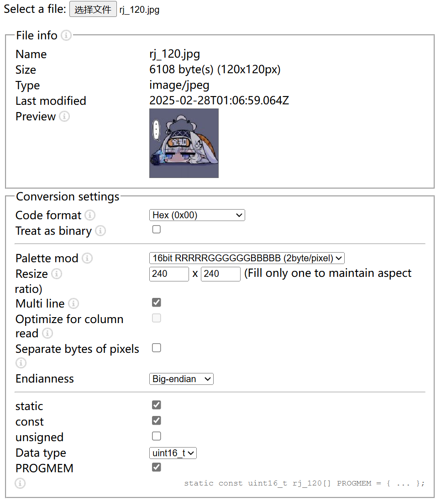

## 常用库

### Json格式提取

#### ArduinoJson

**ArduinoJson** 是一个用于在 Arduino 和其他嵌入式平台上处理 JSON 数据的轻量级库。它允许开发者轻松地解析、生成和操作 JSON 数据，非常适合用于处理来自网络请求的响应、配置文件或其他结构化数据。 主要特点
1.轻量级：
设计针对内存受限的环境，内存占用小。
2.易于使用：
提供直观的 API，简单的语法使得 JSON 的创建和解析变得方便。
3.支持动态和静态内存分配：
可以根据需求选择动态分配内存或使用静态数组，适应不同的使用场景。
4.文档生成：
支持生成和解析 JSON 文档，便于处理复杂的数据结构。
Json格式的读取与写入我们使用ArduinoJson库完成

### Web服务器

#### ESPAsyncWebServer

ESPAsyncWebServer 是一个为 ESP8266 和 ESP32 平台设计的异步 Web 服务器库。与传统的 Web 服务器库相比，它允许在处理 HTTP 请求时非阻塞地执行其他操作，适合于需要同时处理多个连接的应用。 主要特点
1.异步处理：
允许同时处理多个客户端连接，而不会阻塞主程序流。
2.简单的 API：
提供易于使用的 API，可以快速设置路由和处理 HTTP 请求。
3.支持多种 HTTP 方法：
支持 GET、POST、PUT、DELETE 等多种 HTTP 方法。
4.处理静态文件：
能够直接提供存储在 SPIFFS 或 LittleFS 文件系统中的静态文件（如HTML、CSS、JavaScript 文件等）。
5.WebSocket 支持：
支持 WebSocket，允许与客户端进行实时双向通信。
为了实现本地网页配网，我们需要一个Web本地服务器

### TFT_eSPI

显示自定义图片，图片转换需要注意配置如下。

**Endianness**为大端模式!!!(我真服了)

