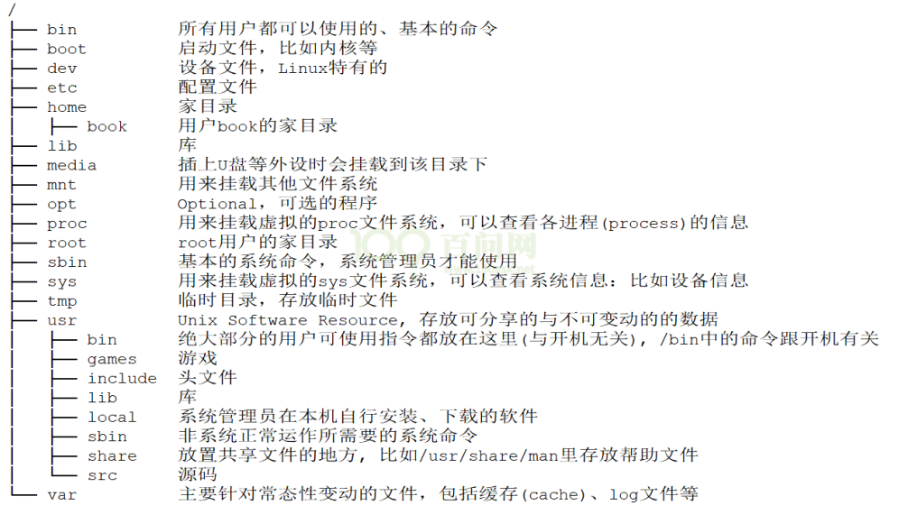
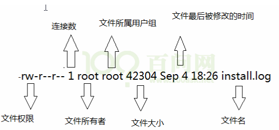
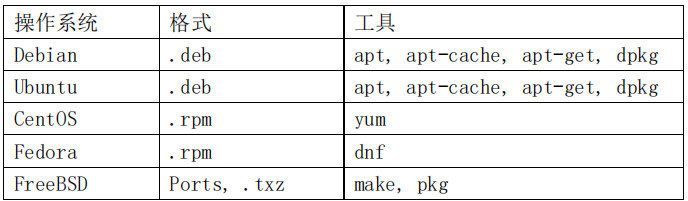
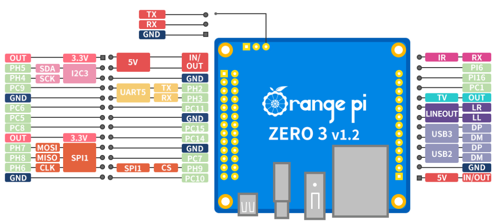
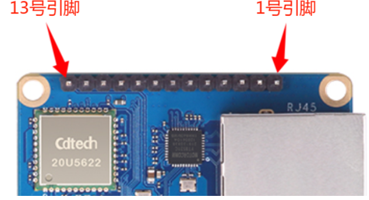
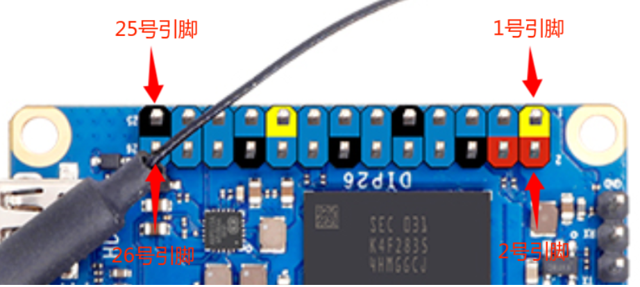
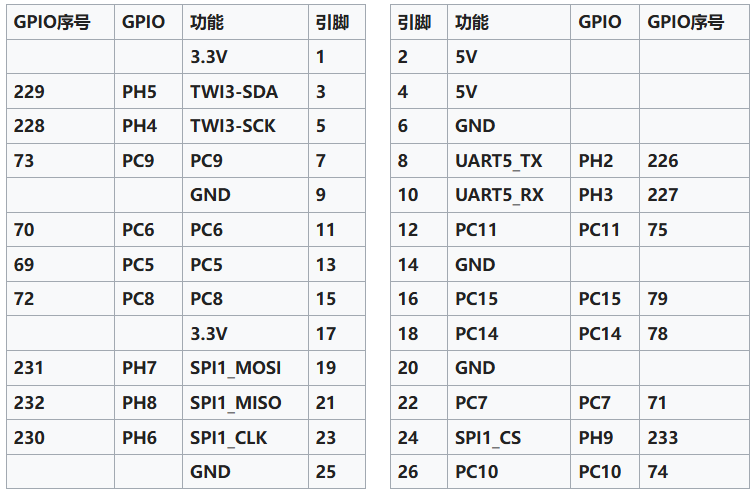
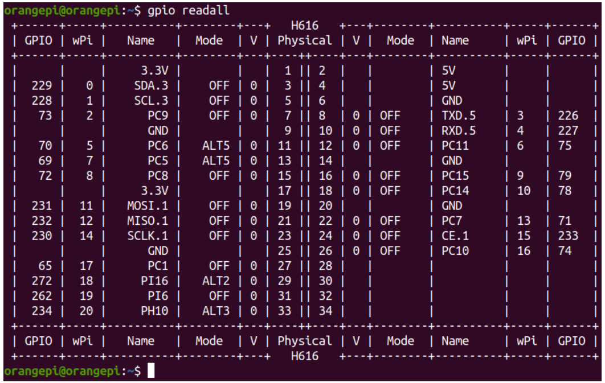

基础网络知识

**IP地址**：用于标识网络设备的唯一地址，类似“门牌号”，确保数据能正确路由到目标设备。

- ipv4
- ipv6

- 公网ip：互联网全局唯一，可直接访问（如服务器、路由器WAN口）。
- 私网ip：局域网内设备共享一个公网IP，需通过NAT转换才能访问公网（如 `192.168.x.x`、`10.x.x.x`）。

**NAT**：将私网IP映射为公网IP，实现多设备共享上网。例如：家庭路由器通过NAT将 `192.168.1.100` 转换为公网IP `120.80.1.1` 访问互联网。

子网掩码：划分IP地址的**网络部分**和**主机部分**，确定设备是否在同一子网。例如IP `192.168.1.100`，掩码 `255.255.255.0` → 网络号 `192.168.1.0`，主机号 `100`。

DNS：ip与域名映射

## Ubuntu基础知识

#### 文件系统

**Windows** 下某个文件的绝对路径以盘符开始，比如：C:\abc\def\hello.txt，这是在 C 盘的 abc 目录下，有 def 子目录；而 def 中有 hello.txt 文件。
<!--ID: 1764664440203-->


**Ubuntu** 中，以树状结构表示文件夹与文件，没有盘符的概念。比如：/abc/def/hello.txt，这表示在根目录下有 abc 子目录，而 abc 下又有 def 目录；def 中有 hello.txt 文件。

- 可以执行命令：`df -h`查看分区挂载在哪个目录下。

Ubuntu 中的目录遵循 **FHS** 标准(Filesystem Hierarchy Standard，文件系统层次标准)。它定义了文件系统中目录、文件分类存放的原则、定义了系统运行所需的最小文件、目录的集合，



#### 文件属性

使用`ls`查看当前目录文件。
<!--ID: 1764664440211-->




- 第一个字符表示“文件类型”，它是目录、文件或链接文件等。

> d 目录  - 文件  l 链接文件  b 设备文件里的可供存储的接口设备 c 设备文件里的串行端口设备，如鼠标、键盘等

- 文件类型后面的 9 个字符以 3 个为一组，第一组表示“文件所有者的权限”；第二组表示“用户组的权限”；第三组表示“其他非本用户组的权限”。每组都是 rwx 的组合，其中 r 代表可读，w 代表可写，x 代表可执行；如果没有对应的权限，就会出现减号（-）。比如“rw-r--r--”表示

#### 常用命令

需要时查询，边用边记
<!--ID: 1764664440214-->


Shell 的意思是“外壳”，在 Linux 中它是一个程序，比如/bin/sh、/bin/bash 等。它负责接收用户的输入，根据用户的输入找到其他程序并运行。比如我们输入“ls”并回车时，shell 程序找到“ls”程序并运行，把结果打印出来。

#### 下包管理

像我们日常使用的 windows 提供的应用商店或者手机提供的应用市场那样，大多数现代的类 Unix 操作系统也都提供了一种中心化的机制用来搜索和安装软件。软件通常存放在存储库中，并通过包的形式对外进行分发。处理包的工作称为**包管理**。包提供了操作系统的基本组件，以及共享的库、应用程序、服务和文档。这个我们称为软件包管理系统，其除了安装软件外，它还提供了工具来更新已经安装的包。
<!--ID: 1764664440220-->


大多数软件包系统都是围绕软件包文件的集合构建的。软件包文件通常是一个存档文件，它包含已编译的二进制文件和软件的其他资源，以及安装脚本。软件包文件同时也包含有价值的元数据，包括它们的依赖项，以及安装和运行它们所需的其他软件包的列表。



**apt**：软件包管理工具。提供了大多数常见的命令如：搜索存储库、安装软件包及其依赖项，并管理升级，等等。

一般来说Ubuntu 下很多软件是需要先自行提供源码，使用源码自行编译，编译完成以后使用命令”install”来安装到系统中。当然 Ubuntu 下也有其它的软件安装方法，使用得最多的方法就是自行编译源码后进行安装，尤其是嵌入式 Linux 开发。

**Install**指令

```
install [选项 ]... [-T] 源文件 目标文件
install [选项 ]... 源文件 ... 目录
install [选项 ]... -t 目录 源文件 ... 或： install [选项 ]... -d 目录 ...
```

APT 下载工具和上面讲解到的 ”install” 命令结合构成了 Ubuntu 下最常用的下载和安装软件方法。

## Orangepi3 Zero 开发日记


<!--ID: 1764664440226-->


联网指令``sudo nmcli dev wifi connect wifi_name password wifi_passwd``

查看ip地址

- 使用串口``ip addr show wlan0``

- 使用windows在同一网络下，``arp -a | findstr "192.168"``

#### 13pin

引脚序列
<!--ID: 1764664440230-->




原理图


#### 26pin

26pin接口中总共有**17**个GPIO口，所有GPIO口的电压都是**3.3v**
<!--ID: 1764664440233-->






1. 其中1到26号引脚与开发板上的26 Pin引脚是一一对应的
2. 27号引脚对应开发板上13pin的10号引脚
3. 29号引脚对应开发板上13pin的11号引脚
4. 31号引脚对应开发板上13pin的12号引脚
5. 33号引脚对应开发板上13pin的13号引脚



#### 虚拟环境管理工具venv

需要对不同的代码设置不同的Python虚拟环境。
<!--ID: 1764664440236-->


- Python虚拟环境是指一个隔离的Python环境，它为每个项目提供一个独立的空间来安装所需的依赖库，避免不同项目之间的依赖冲突。这样，每个项目可以使用特定的Python版本和库版本，不会干扰其他项目。例如，代码A可能需要特定版本的某个库，而代码B需要更新的版本，通过创建不同的虚拟环境，可以分别满足这两个项目的需要，确保每个项目的依赖都能正常工作。

```
python3 -m venv dir_name
```

```text
source ./dir_name/bin/activate
```

```text
pip install packages_name
```

安装的包放在`./test_env/lib/pythonx.x/site-packages` 目录下

```text
deactivate
```