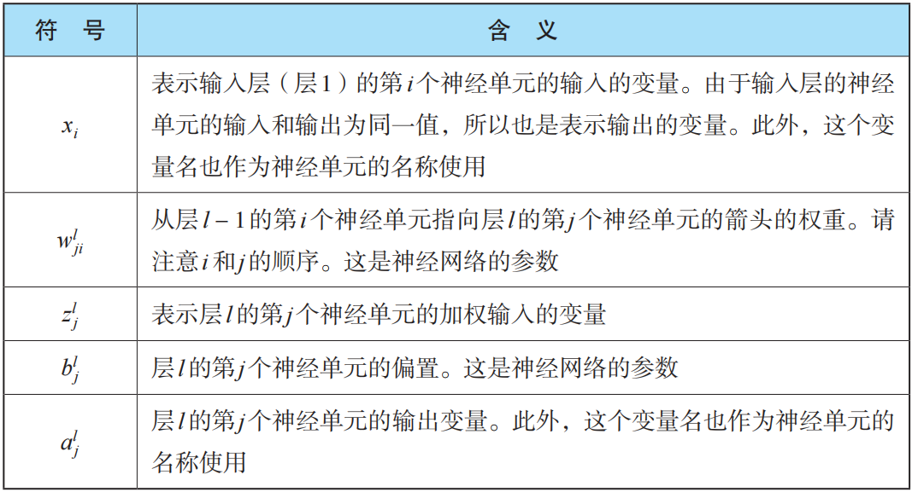
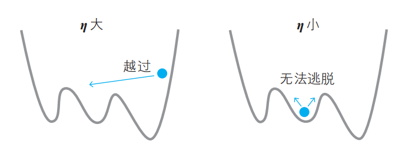
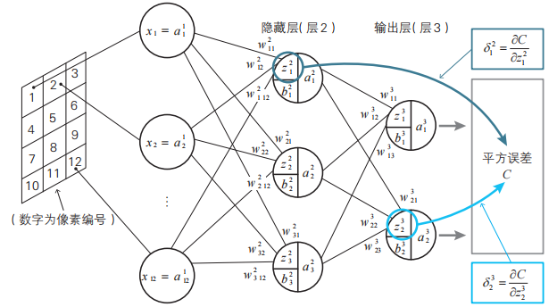

### 梯度下降法

寻找最小值的点的方法.将图像看作斜坡，在斜坡上的点 *P* 处放一个乒乓球，然后轻轻地松开手，球会沿着最陡的坡面开始滚动，待球稍微前进一点后，把球止住，然后从止住的位置再次松手，乒乓球会从这个点再次沿着最陡的坡面开始滚动。
<!--ID: 1764664440173-->

哈密顿算子
$$
\nabla f = \left( \frac{\partial f}{\partial x_1}, \frac{\partial f}{\partial x_2}, \ldots, \frac{\partial f}{\partial x_n} \right)
$$
梯度下降规则
$$
(\Delta x_1, \Delta x_2, \ldots, \Delta x_n) = -\eta \nabla f \quad (\eta \text{为正的微小常数})
$$
$\eta$为学习率

### 误差反向传播法

误差反向传播法的特点是将繁杂的导数计算替换为数列的递推关系式 。
<!--ID: 1764664440178-->

神经单元误差$\delta^l_j=\frac{\partial C}{\partial z^l_j}$
$$
\frac{\partial C}{\partial w^l_{ji}}=\delta^l_ja^{l-1}_i
$$

$$
\frac{\partial C}{\partial b^l_{j}}=\delta^l_j
$$

$$
\delta^l_L=\frac{\partial C}{\partial a^L_j}a^`(z^l_j)
$$

输出层神经单元误差与激活函数、平方误差函数有关。

中间层的反向递推关系式
$$
\delta_{1}^{2} = \frac{\partial C}{\partial z_{1}^{2}} = \frac{\partial C}{\partial z_{1}^{3}} \frac{\partial z_{1}^{3}}{\partial a_{1}^{2}} \frac{\partial a_{1}^{2}}{\partial z_{1}^{2}} + \frac{\partial C}{\partial z_{2}^{3}} \frac{\partial z_{2}^{3}}{\partial a_{1}^{2}} \frac{\partial a_{1}^{2}}{\partial z_{1}^{2}}
$$

$$
\delta_{1}^{2} = (\delta_{1}^{3}w^3_{11}+\delta_{2}^{3}w^3_{21})a^`(z^2_1)
$$

$$
\delta_{i}^{l} = \left\{ \delta_{1}^{l+1} w_{1i}^{l+1} + \delta_{2}^{l+1} w_{2i}^{l+1} + \cdots + \delta_{m}^{l+1} w_{mi}^{l+1} \right\} a'(z_{i}^{l})
$$

只要求出输出层的神经单元误差，其他的神经单元误差就不需要进行偏导数计算

