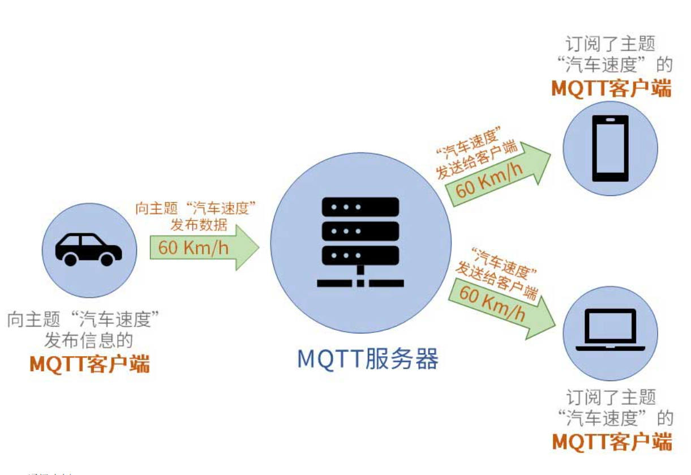
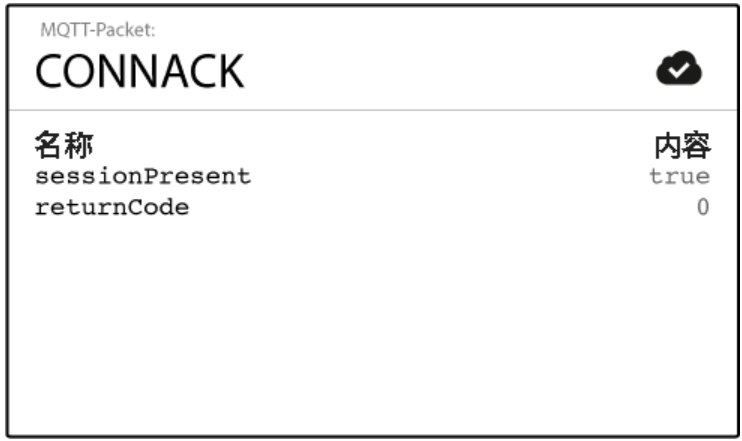
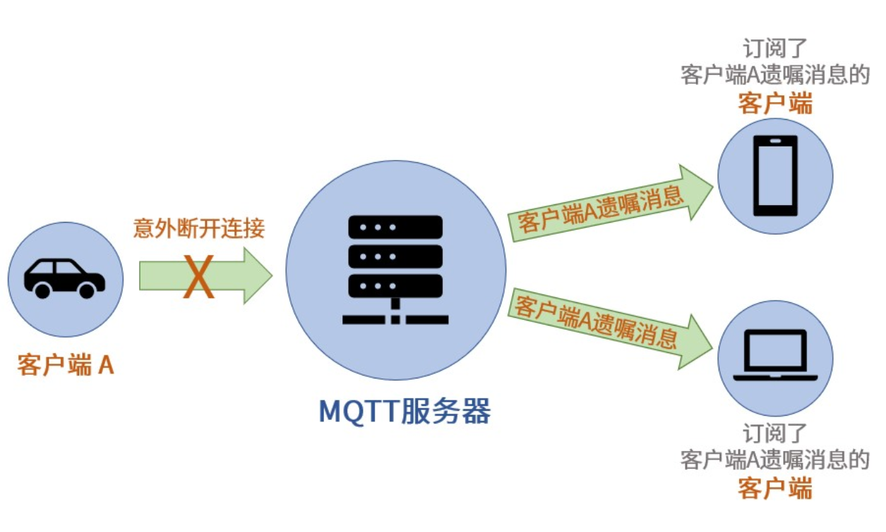
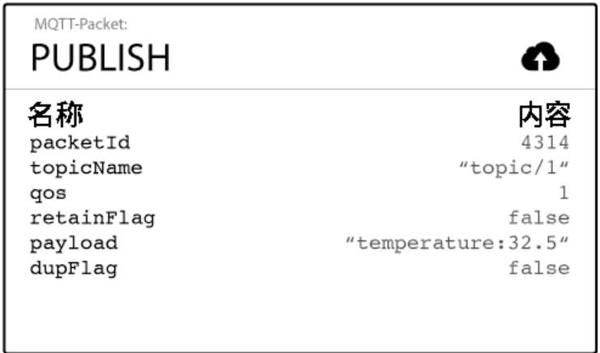
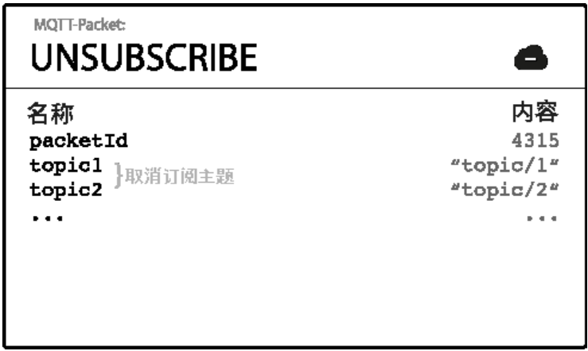

### MQTT基本概念

#### MQTT元素

MQTT服务端

MQTT服务端通常是一台服务器。它是MQTT信息传输的枢纽，负责将MQTT客户端发送来的信息传递给MQTT客户端。MQTT服务端还负责管理MQTT客户端。确保客户端之间的通讯顺畅，保证MQTT消息得以正确接收和准确投递。

MQTT客户端

MQTT客户端可以向服务端发布信息，也可以从服务端收取信息。客户端发送信息的行为成为**“发布”**信息。而客户端要想从服务端收取信息，则首先要向服务端**“订阅”**信息。

MQTT主题

在MQTT通讯中，客户端所订阅的是一个个**“主题”**。MQTT服务端在管理MQTT信息通讯时，就是使用“主题”来控制的。

#### 客户端连接服务器

**MQTT客户端连接服务端一共有两步**

1. 首先MQTT客户端将会向服务端发送连接请求。该请求实际上是一个包含有连接请求信息的数据包。这个数据包的官方名称为**CONNECT**
2. MQTT服务端收到客户端连接请求后，会向客户端发送连接确认。同样的，该确认也是一个数据包。这个数据包官方名称为**CONNACK**。

CONNECT**报文**:

- **clientId – 客户端ID**：ClientId是MQTT客户端的标识。MQTT服务端用该标识来识别客户端。因此ClientId必须是独立的。如果两个MQTT客户端使用相同ClientId标识，服务端会把它们当成同一个客户端来处理。
- **cleanSession – 清除会话**：cleanSession 被设置为**“true”**。那么服务端不需要客户端确认收到报文，也不会保存任何报文。在这种情况下，即使客户端错过了服务端发来的报文，也没办法让服务端再次发送报文。cleanSession 被设置为“**false**”。将尚未被客户端确认的报文保存起来再次尝试向客户端发送报文，并且再次等待客户端发来确认信息。
- **Quality of Service - 服务质量**

  - 若想实现QoS>0，订阅端连接服务端时cleanSession需要设置为false，订阅端订阅主题时QoS>0，发布端发布消息时的QoS>0。

  - 服务端会选择发布消息和订阅消息中较低的QoS来实现消息传输，这也被称作“服务降级”。

  - QoS = 0, 占用的网络资源最低，但是接收端可能会出现无法接收消息的情况，所以适用于传输重要性较低的信息。

  - QoS = 1, MQTT会确保接收端能够接收到消息，但是有可能出现接收端反复接收同一消息的情况。

  - QoS = 2, MQTT会确保接收端只接收到一次消息。但是QoS为2时消息传输最慢，另外消息传输需要多次确认，因此所占用的网络资源也是最多的。此类服务等级适用于重要消息传输。

  - 由于QoS1和QoS2都能确保客户端接收到消息，但是QoS1所占用的资源较QoS2占用资源更小。因此建议使用QoS1来实现网络资源较为珍贵的环境下传输重要信息。
- **keepAlive**：客户端在没有向服务端发送信息时，可以定时向服务端发送一条消息。这条用于心跳机制的消息也被称作**心跳请求**（PINGREQ）。心跳请求的作用正是用于告知服务端，当前客户端依然在线。服务端在收到客户端的心跳请求后，会回复一条消息。这条回复消息被称作**心跳响应**（PINGRESP）。
  - keepAlive数值为60。这就意味着，客户端的心跳间隔时间是60秒
  - 如果服务端没有在1.5倍心跳时间间隔内收到客户端发布消息(PUBLISH)或发来心跳请求(PINGREQ)，那么服务端就会认为这个客户端已经掉线。

- **lastWillTopic – 遗嘱主题**：只有那些订阅了这一遗嘱主题的客户端才会收到本客户端的遗嘱消息。
- **lastWillMessage – 遗嘱消息**
- **lastWillQoS – 遗嘱QoS**：同样可以使用服务质量来控制遗嘱消息的传递和接收。这里的服务质量与普通MQTT消息的服务质量是一样的概念。也可以设置为0、1、2。
- **lastWillRetain – 遗嘱保留**：遗嘱消息也可以设置为保留消息，

CONNACK报文**

**returnCode – 连接返回码**

当服务端收到了客户端的连接请求后，会向客户端发送returnCode(连接返回码)，用以说明连接情况。如果客户端与服务端成功连接，则返回数字“0”。如果未能成功连接，连接返回码将会是一个非零的数值。

**sessionPresent – 当前会话**

当客户端发送的CONNECT报文中的cleanSession设置为false时，在这种情况下，如果服务端的确保存了没有收到客户端接收确认的报文信息，那么sessionPresent为true

#### 主题

主题的最基本形式就是一个字符串。

***区分大小写、可使用空格但最好别用、别用中文***

**主题分级**：为了更好的对主题进行管理和分类，我们可以对主题进行分级处理。MQTT主题各个级别之间可以使用”/”来分隔。

**主题通配符**：当客户端订阅主题时，可以使用通配符同时订阅多个主题。通配符只能在订阅主题时使用

- 单级通配符："+"  事例：home/sensor/+/temperature
- 多级通配符："#"  事例：home/sensor/#（多级通配符必须是主题中的最后一个字符）

注意事项

- **以$开始的主题**：是MQTT服务端系统保留的特殊主题，不能随意订阅或者向其发布信息。
- **不要用 “/” 作为主题开头**：会额外产生一个没有用处的主题级别。
- **在主题中嵌入客户端ID**：可以为开发和管理MQTT信息提供便利。通过主题中的客户端ID内容，可以很容易的了解该主题信息是由哪一台设备所发布的。

#### 遗嘱

MQTT协议允许客户端在“活着”的时候就写好遗嘱，这样一旦客户端意外断线，服务端就可以将客户端的遗嘱公之于众。

用户密码认证

- 有些MQTT服务端需要客户端在连接时提供用户名和密码。只有客户端正确提供了用户名和密码后，才能连接服务端。

- 有些公用MQTT服务端也利用此信息来识别客户端属于哪一个用户，从而对客户端进行管理。比如用户可以拥有私人主题，这些主题只有该用户可以发布和订阅。对于私人主题，服务端就可以利用客户端连接时的用户名和密码来判断该客户端是否有发布订阅该用户私人主题的权限。

### MQTT基本操作

#### 客户端基本操作

##### PUBLISH – 发布信息

MQTT客户端发布消息时，会向服务端发送PUBLISH报文。

**topicName – 主题名**：主题名用于识别此信息应发布到哪一个主题。

**QoS – 服务质量等级**：QoS（Quality of Service）表示MQTT消息的服务质量等级。QoS有三个级别：0、1和2。QoS决定MQTT通讯有什么样的服务保证。

**packetId – 报文标识符**：报文标识符可用于对MQTT报文进行标识。不同的MQTT报文所拥有的标识符不同。MQTT设备可以通过该标识符对MQTT报文进行甄别和管理。请注意：报文标识符的内容与QoS级别有密不可分的关系。只有QoS级别大于0时，报文标识符才是非零数值。如果QoS等于0，报文标识符为0。

**retainFlag – 保留标志**：在默认情况下，当客户端订阅了某一主题后，并不会马上接收到该主题的信息。只有在客户端订阅该主题后，服务端接收到该主题的新信息时，服务端才会将最新接收到的该主题信息推送给客户端。但是在有些情况下，我们需要客户端在订阅了某一主题后马上接收到一条该主题的信息。这时候就需要用到**保留标志**这一信息。

**Payload – 有效载荷**：有效載荷是我们希望通过MQTT所发送的实际内容。可以使用MQTT协议发送文本，图像等格式的内容。这些内容都是通过有效載荷所发送的。

**dupFlag – 重发标志**：当MQTT报文的接收方没有及时确认收到报文时，发送方会重复发送MQTT报文。在重复发送MQTT报文时，发送方会将此“重发标志”设置为true。请注意，重发标志只在QoS级别大于0时使用。

##### SUBSCRIBE – 订阅主题

客户端通过向服务端发送SUBSCRIBE报文发送订阅请求，报文包含有topicName – 主题名、QoS、packetId

##### SUBACK – 订阅确认

SUBACK报文包含有“**订阅返回码”**和“报文标识符”

**returnCode – 订阅返回码**：客户端向服务端发送订阅请求后，服务端会针对SUBSCRIBE报文中的所有订阅主题来逐一回复给客户端一个返回码。

| 返回码 | Return Code Response |
| :----- | :------------------- |
| 0      | 订阅成功 – QoS 0     |
| 1      | 订阅成功- QoS 1      |
| 2      | 订阅成功- QoS 2      |
| 128    | 订阅失败             |

##### UNSUBSCRIBE – 取消订阅

代码事例1-4连接服务端、1-6发送消息、1-8订阅主题、2-2QoS应用、2-4保留消息应用、2-7遗嘱应用