# STM32CubeIDE开发(一），快速开发流程初体验


​             
​                
                    **目录**
<!--ID: 1764664440130-->


 

[一、cubeIDE下载、安装](#t0 )


[ 二、创建工程及配置芯片引脚](#t1 )


[三、编码及编译](#t2 )


[四、加载已编译程序到硬件及测试](#t3 )


[五、程序运行效果](#t4 )

 

------

 

#### 一、[cubeIDE](https://so.csdn.net/so/search?q=cubeIDE&spm=1001.2101.3001.7020 )下载、安装


        [STM32CubeIDE](https://so.csdn.net/so/search?q=STM32CubeIDE&spm=1001.2101.3001.7020 )是STM32Cube软件生态系统的一部分，是面向st芯片的高级C/C++开发平台，具有STM32微控制器和微处理器的外设配置、代码生成、代码编译和调试功能。它基于Eclipse®/CDT™框架和用于开发的GCC工具链，以及用于调试的GDB。它支持集成数以百计的现有插件，正是这些插件使Eclipse® IDE的功能趋于完整。STM32CubeIDE集成了STM32CubeMX的STM32配置与项目创建功能，在通过所选板卡或示例选择一个空的STM32 MCU或MPU，或者预配置微控制器或微处理器之后，将创建项目并生成初始化代码。在开发过程的任何时间，用户均可返回外设或中间件的初始化和配置阶段，并重新生成初始化代码，期间不会影响用户代码。
<!--ID: 1764664440133-->


 

        下载地址：[STM32CubeIDE - STM32的集成开发环境 - STMicroelectronics](https://www.st.com/zh/development-tools/stm32cubeide.html "STM32CubeIDE - STM32的集成开发环境 - STMicroelectronics")，需要邮箱获得下载许可

 

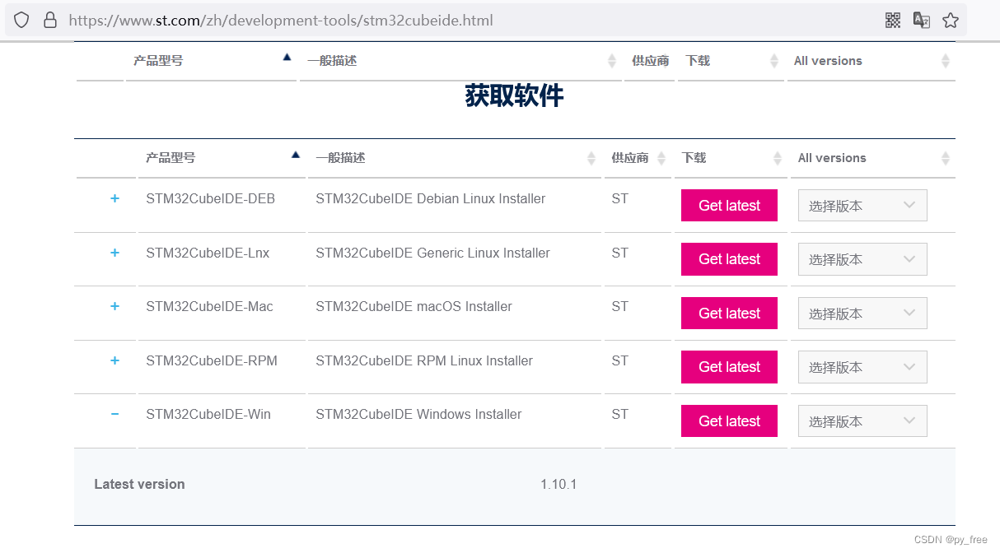


 汉化包地址：[Index of /eclipse/technology/babel/update-site/](http://mirrors.ustc.edu.cn/eclipse/technology/babel/update-site/ "Index of /eclipse/technology/babel/update-site/")


本文安装时汉化包版本：


在线安装路径：[Index of /eclipse/technology/babel/update-site/R0.19.2/2021-12/](http://mirrors.ustc.edu.cn/eclipse/technology/babel/update-site/R0.19.2/2021-12/ "Index of /eclipse/technology/babel/update-site/R0.19.2/2021-12/")


直接下载离线安装：[http://mirrors.ustc.edu.cn/eclipse/technology/babel/update-site/R0.19.2/babel-R0.19.2-2021-12.zip   ](http://mirrors.ustc.edu.cn/eclipse/technology/babel/update-site/R0.19.2/babel-R0.19.2-2021-12.zip%C2%A0%C2%A0%C2%A0 "http://mirrors.ustc.edu.cn/eclipse/technology/babel/update-site/R0.19.2/babel-R0.19.2-2021-12.zip   ")


下载完stmcubeIDE后，双击安装包完成安装：


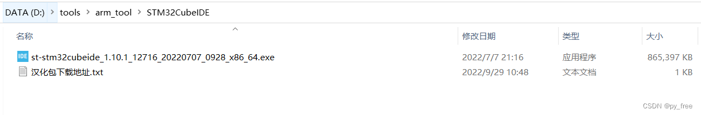


安装完成后，去help->install new software配置安装汉化包


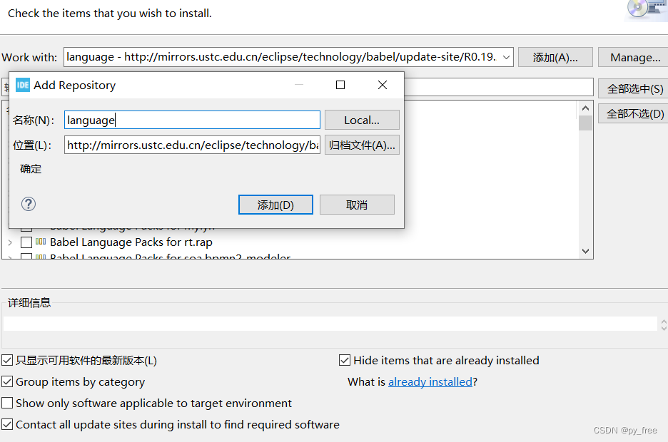


 选择简体中文完成在线安装


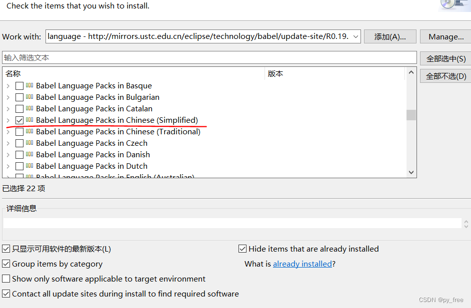

 

####  二、创建工程及配置芯片引脚


        汉化完后，重启软件，在文件->新建工程->stm32 project,输入自有芯片型号，本文是STM32L496VGTx
<!--ID: 1764664440136-->


 

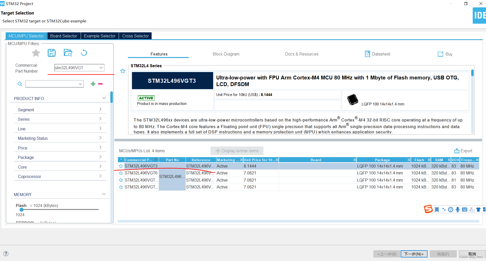


 点击下一步，输入工程名，选择工程路径，完成工程创建


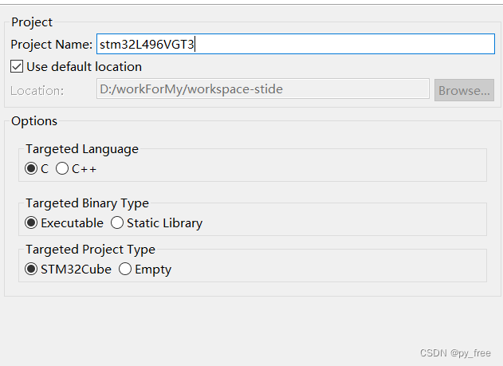


         工程完成创建后，直接弹出cubeMX配置界面，可以图形化配置芯片引脚接口

 

        开启USB串口能力

 

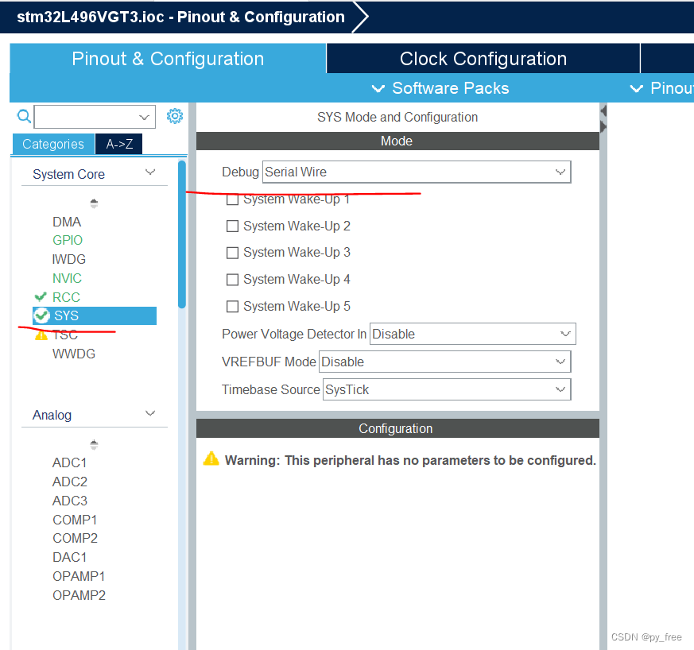


         本文仅开始外部高速时钟（HSE）

 

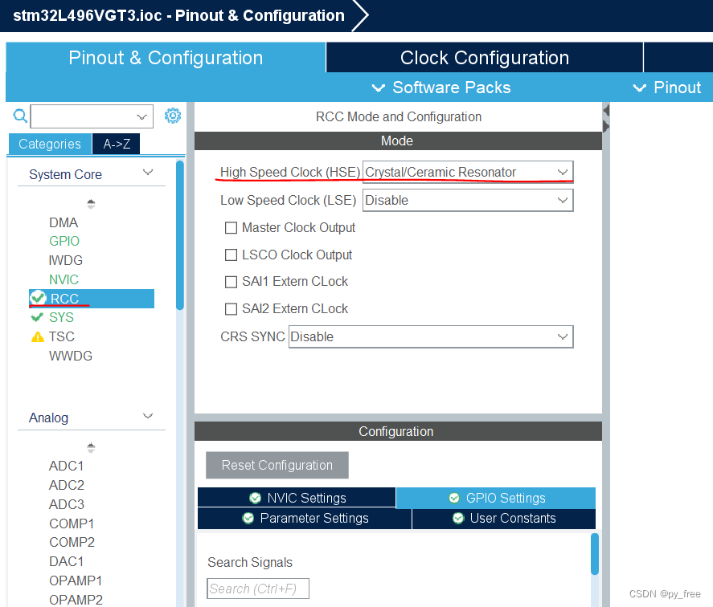


         系统时钟频率直接拉满到80MHz

 


         为了简单测试工程，仅仅配置三个按键及三个LED灯的GPIO

 

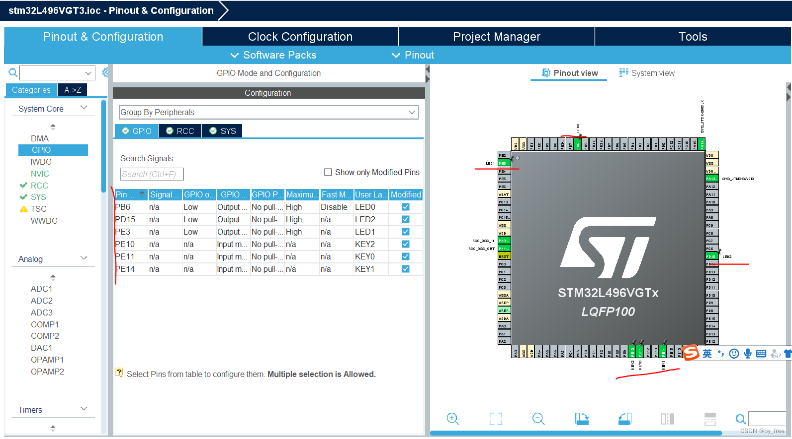


         工程管理，保持默认设置，

 

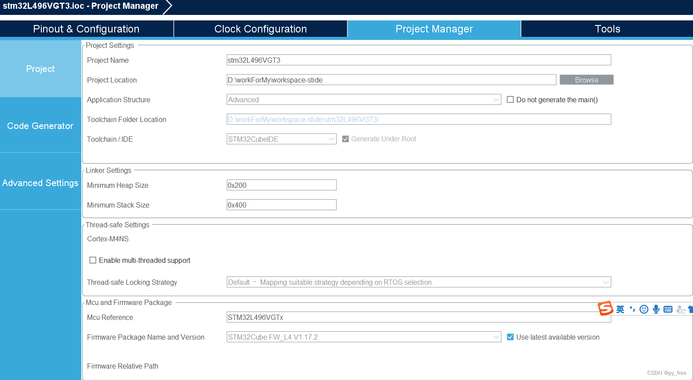


         代码生产页面，只按需生成，为每个接口类型生成独立头文件及源码文件

 

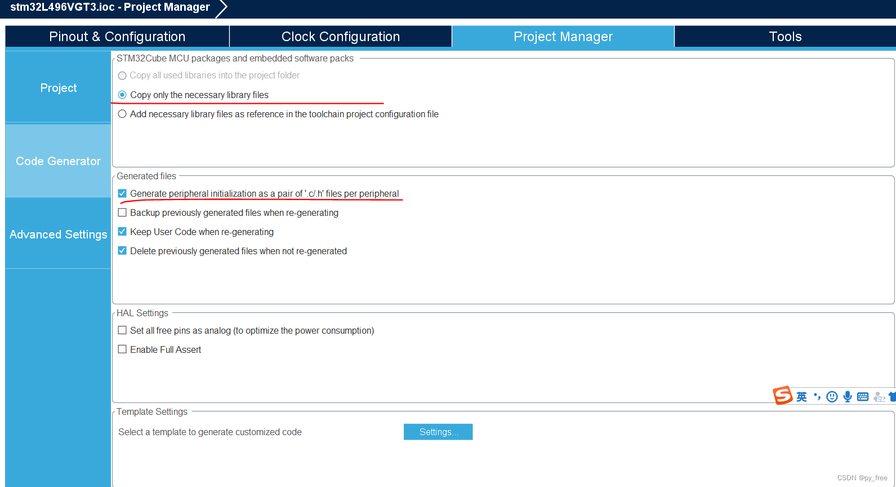


         高级设置页面，保持设置，1）本文GPIO选择HAL库实现，也可以点击选择LL库，2）GPIO初始化调用直接生成（main.c中实现），也可在Do Not Generate Call勾选去掉，也可以去掉Visibility(Static)选项，不生成GPIO初始化函数

 

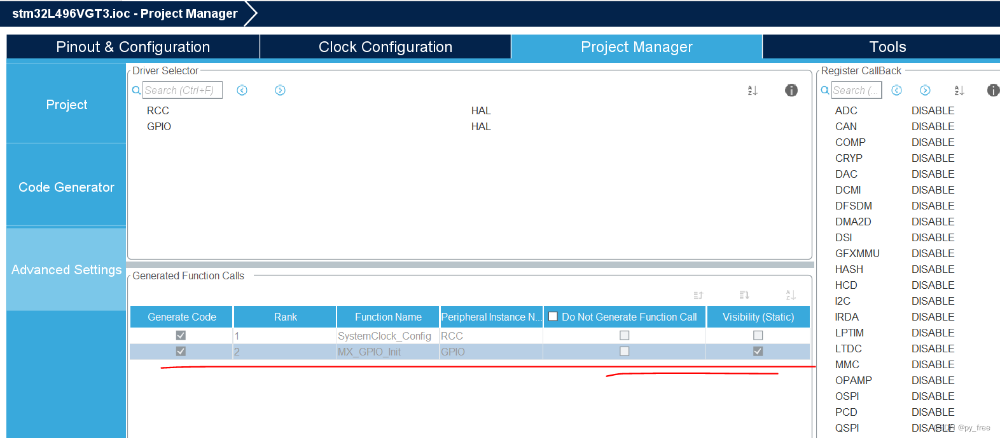


         点击菜单栏保存或代码生产按钮，实现cubeMX配置到源码生成

 

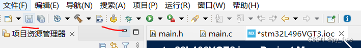


 代码生成后，GPIO接口映射信息配置在main.h中


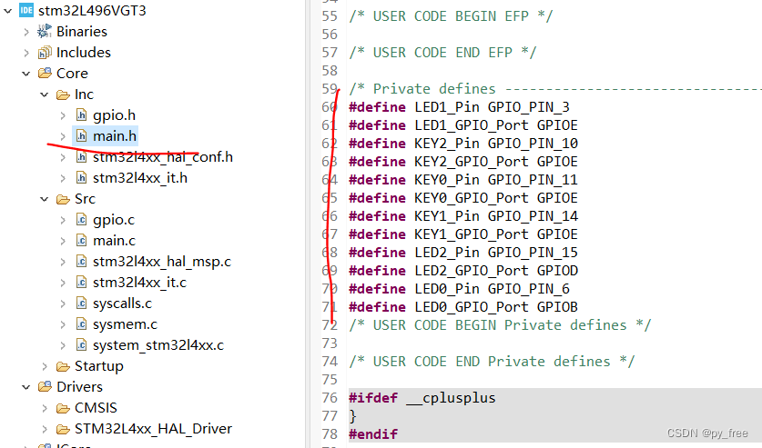


         生成GPIO接口源码为gpoi.h/c，仅仅提供了GPIO初始化函数，实现时调用HAL库函数来实现的。

 

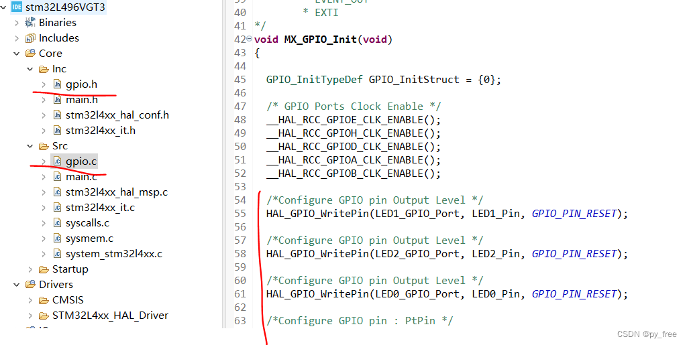

 


        先创建自己的按键及LED驱动，该驱动同样是基于HAL库提供的函数实现，而HAL库和底层硬件打交道，间接帮我们实现对硬件读写控制等能力。

 


#### 三、编码及编译


        在工程目录右键->新建->source Folder创建一个源目录，并添加key.h/c、led.h/c四个源文件
<!--ID: 1764664440139-->


 

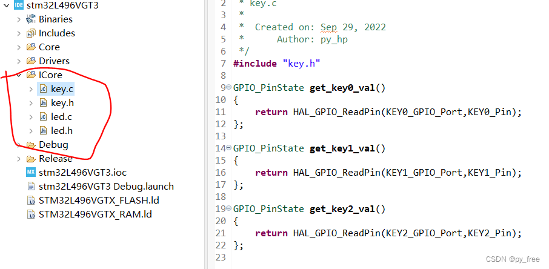


         key.h

 

```cpp
/* * key.h * *  Created on: Sep 29, 2022 *      Author: py_hp */ #ifndef KEY_H_#define KEY_H_ #include "main.h"#include "gpio.h" GPIO_PinState get_key0_val();GPIO_PinState get_key1_val();GPIO_PinState get_key2_val(); #endif /* KEY_H_ */
```

key.c


```cpp
/* * key.c * *  Created on: Sep 29, 2022 *      Author: py_hp */#include "key.h" GPIO_PinState get_key0_val(){	return HAL_GPIO_ReadPin(KEY0_GPIO_Port,KEY0_Pin);}; GPIO_PinState get_key1_val(){	return HAL_GPIO_ReadPin(KEY1_GPIO_Port,KEY1_Pin);}; GPIO_PinState get_key2_val(){	return HAL_GPIO_ReadPin(KEY2_GPIO_Port,KEY2_Pin);};
```

led.h


```cpp
/* * led.h * *  Created on: Sep 29, 2022 *      Author: py_hp */ #ifndef LED_H_#define LED_H_#include "main.h"#include "gpio.h" void Toggle_led0();void Toggle_led1();void Toggle_led2(); void set_led0_val(GPIO_PinState PinState);void set_led1_val(GPIO_PinState PinState);void set_led2_val(GPIO_PinState PinState); #endif /* LED_H_ */
```

led.c


```cpp
/* * led.c * *  Created on: Sep 29, 2022 *      Author: py_hp */#include "led.h" void Toggle_led0(){	HAL_GPIO_TogglePin(LED0_GPIO_Port,LED0_Pin);} void Toggle_led1(){	HAL_GPIO_TogglePin(LED1_GPIO_Port,LED1_Pin);} void Toggle_led2(){	HAL_GPIO_TogglePin(LED2_GPIO_Port,LED2_Pin);} void set_led0_val(GPIO_PinState PinState){	HAL_GPIO_WritePin(LED0_GPIO_Port,LED0_Pin,PinState);}; void set_led1_val(GPIO_PinState PinState){	HAL_GPIO_WritePin(LED1_GPIO_Port,LED1_Pin,PinState);}; void set_led2_val(GPIO_PinState PinState){	HAL_GPIO_WritePin(LED2_GPIO_Port,LED2_Pin,PinState);};
```

        在main.c加入key和led实现，在代码预留用户自行区域加入自主编写代码，这样cubeMX改动后再次生产代码不会修改抹去自己已经写入或修改的代码

 

        添加头文件

 

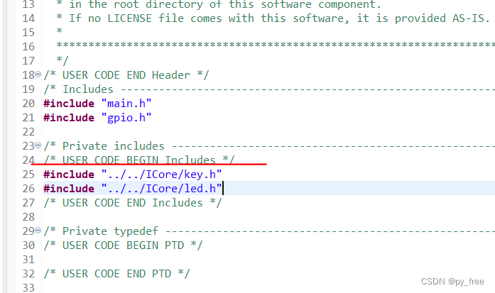


         添加函数调用实现，可自行斟酌调用

 

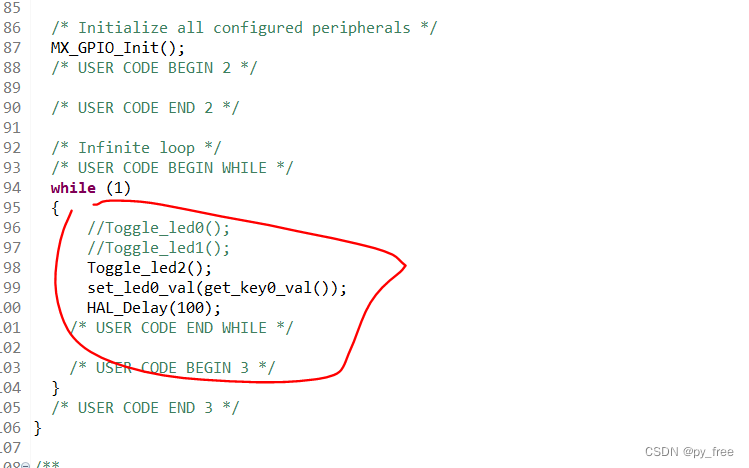


          右键点击项目，进入属性页面（也可以直接菜单进入），勾选本项目编译程序输出文件格式支持

 

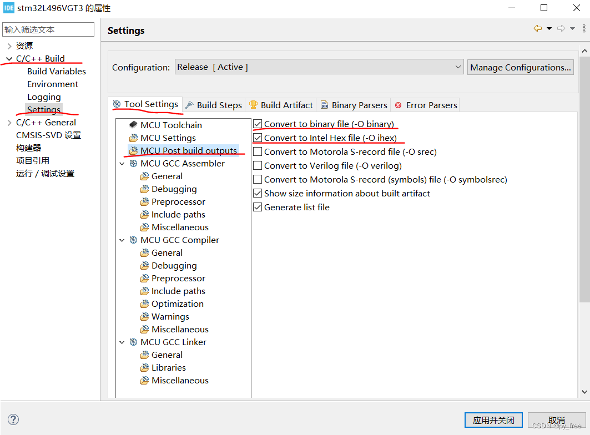


         点击编译按钮完成编译

 

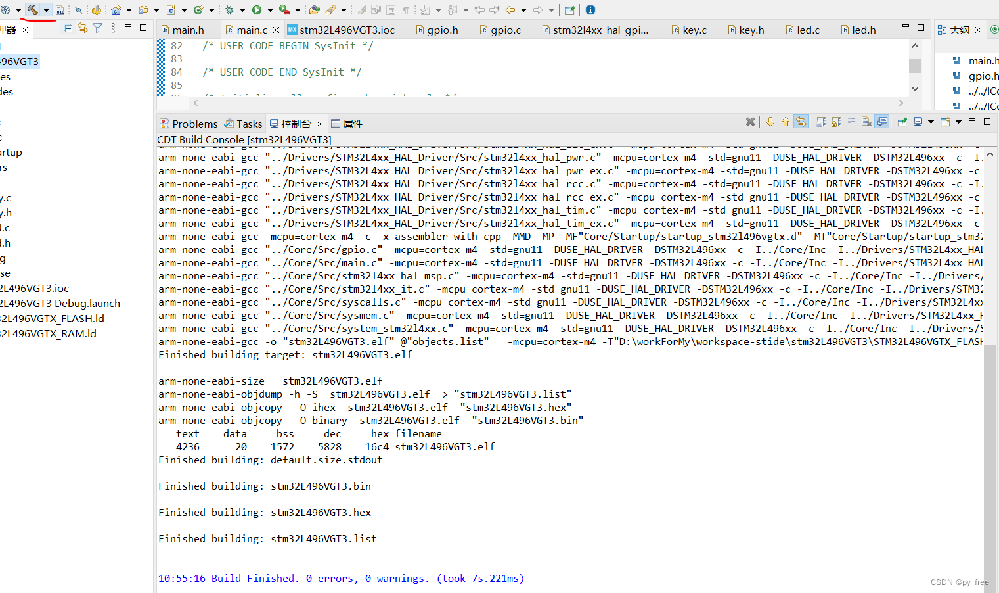

 

#### 四、加载已编译程序到硬件及测试


        点击help->ST-Link更新，运行配置更新，便于直接将编译好的软件下载的硬件上。
<!--ID: 1764664440142-->


 

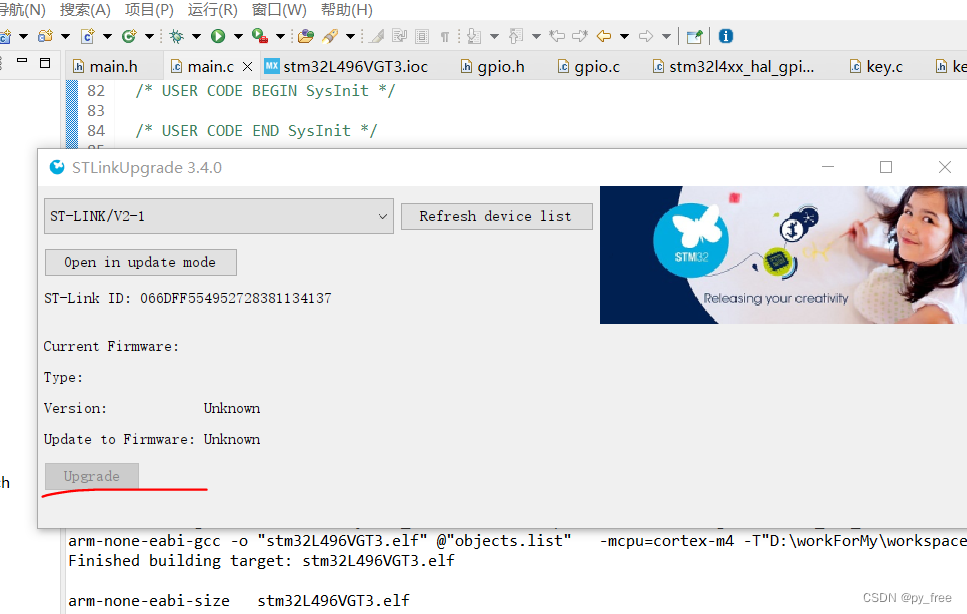


        点击运行工具按钮的运行配置，进入配置页面，在STM32 C/C++ Application新建调试配置，每个项目仅配置一次，后面就可以直接点击运行按钮加载编译好的软件到硬件，

 

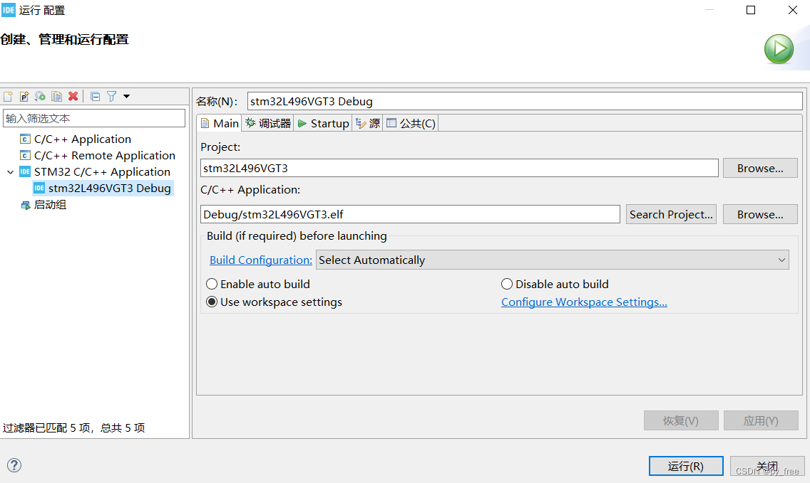


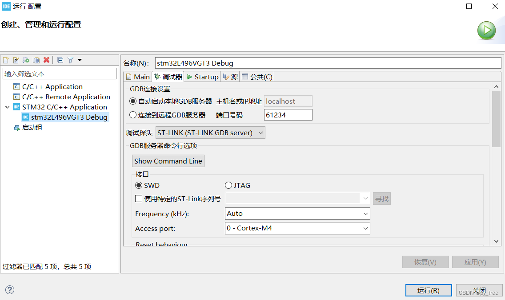


        将电脑与硬件用数据线连接，点击运行下载程序

 

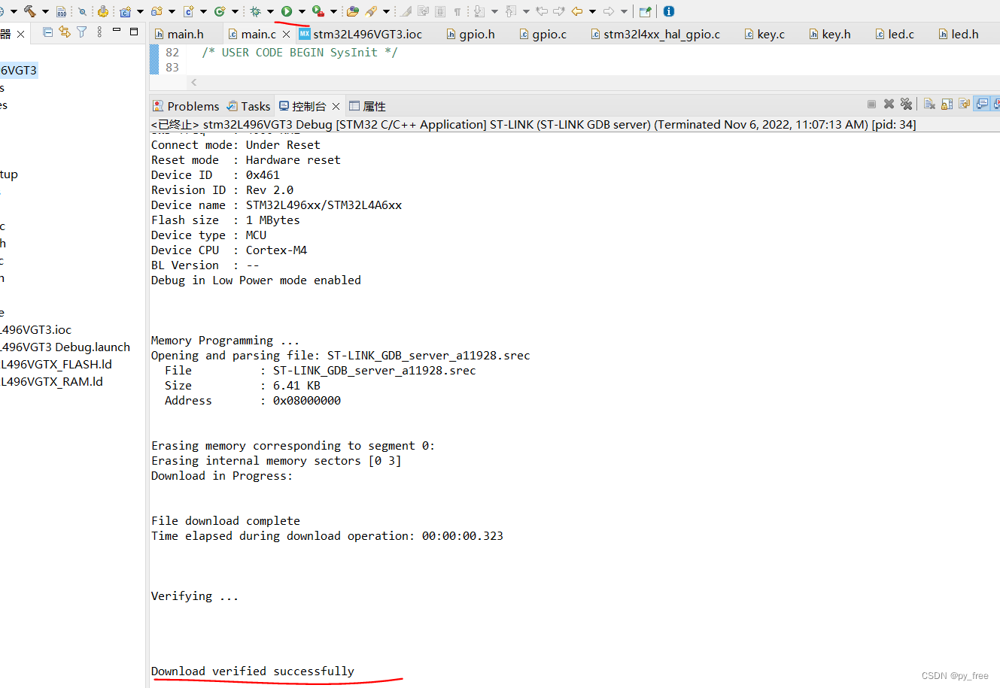


         或者采用其他下载工具，如STM32 ST-LINK Utility加载

 

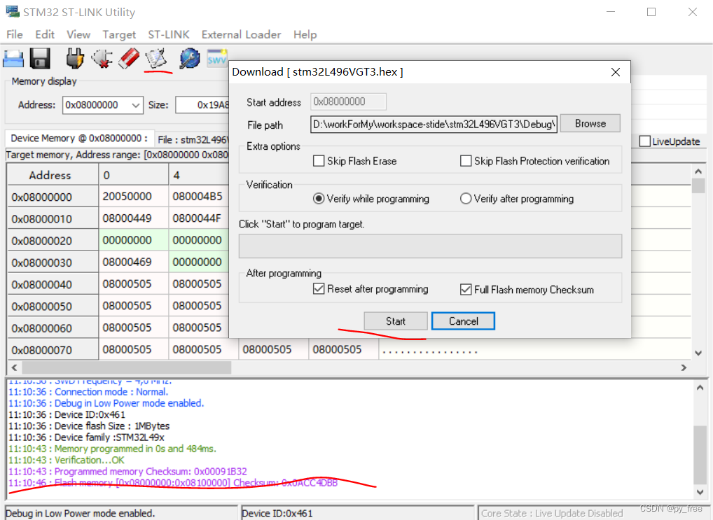

 

#### 五、程序运行效果


        展示效果如下：
<!--ID: 1764664440145-->


 

```cpp
	  Toggle_led2();//闪灯	  set_led0_val(get_key0_val());//按键亮灯	  HAL_Delay(100);
```

        【1】闪灯

 

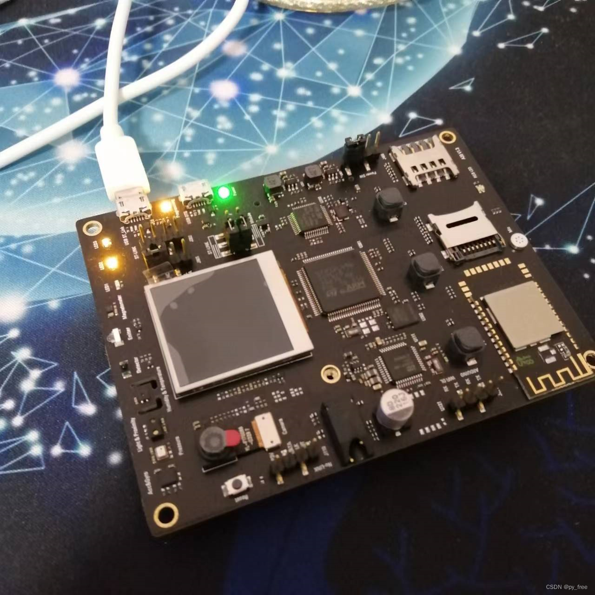


         【2】按键亮灯

 

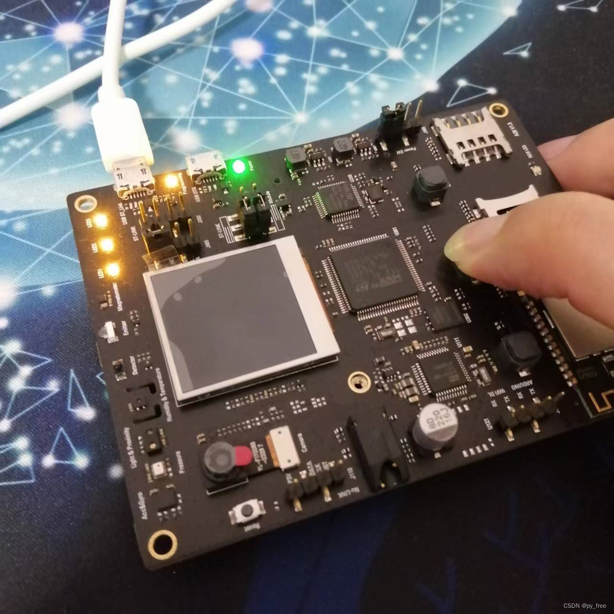

​                

​        